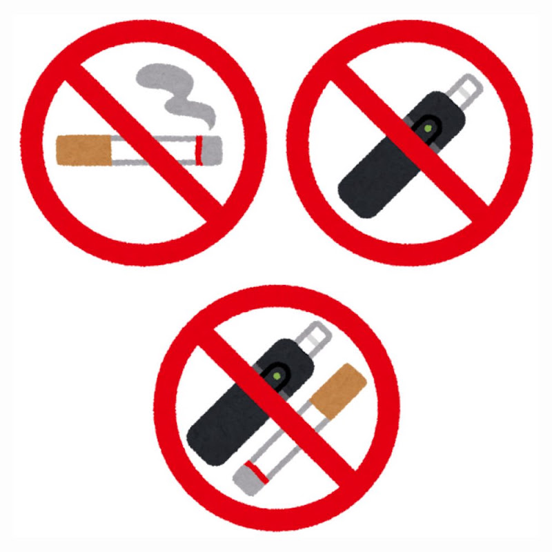
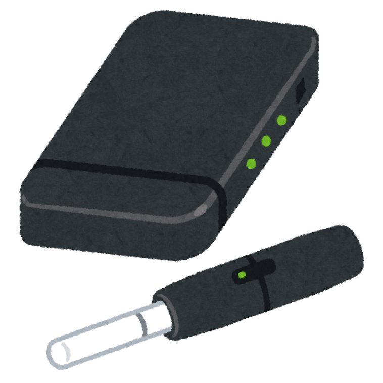

「この年からやめても、もう意味はないんじゃないか」

長く吸ってきた方も、そんな方を見守るご家族も、そう思ったことがあるかもしれません。

2025年、イギリスの研究チームが、たばこをやめた人の、**その後の頭の衰え方**を追いかけた結果を発表しました。

> ✅ 12か国の約9,400人を調べた研究で、**やめた人は、吸い続けた人より、やめた後の記憶などの衰え方がゆるやか**でした
>
> ✅ その差は、**何歳でやめた人でも同じように**見られました
>
> ✅ 日本の高齢者の研究では、**やめて3年以上**たつと、認知症のなりやすさが、吸ったことがない人と同じくらいでした

> 前回の記事では、55歳のころの喫煙の有無を調べた研究をご紹介しました。今回は、その続き「やめた人はどうなったか」です。
> 👉 [55歳ころのカラダは、その後の人生に響くのでしょうか？ 〜認知症にならずに過ごせた年数という見方〜](/posts/midlife-dementia-free-years-2026/)

---

## 目次

1. [やめる前は同じ、やめた後に変わった](#やめる前は同じやめた後に変わった)
2. [やめて何年で、差は縮まるのか](#やめて何年で差は縮まるのか)
3. [体重が増えすぎないように](#体重が増えすぎないように)
4. [加熱式たばこは、どうなのか](#加熱式たばこはどうなのか)
5. [おわりに](#おわりに)
6. [参考にした情報](#参考にした情報)

---

## やめる前は同じ、やめた後に変わった

研究では、イギリス・アメリカ・ヨーロッパの3つの長期調査（12か国・40〜89歳）のデータを使いました。途中でたばこをやめた**4,718人**と、年齢・性別・学歴・**もともとの認知機能**などをそろえた**吸い続けた4,718人**を比べています。

結果は次のとおりです。

- **やめる前の6年間** … 記憶や言葉の出やすさの衰え方は、**2つのグループでほぼ同じ**
- **やめた後の6年間** … やめた人のほうが、**どちらも衰え方がゆるやか**
- **やめた年齢による違い** … **見られませんでした**


衰え方がゆるやかって、どれくらいですか？




正直に言うと、**差はとても小さい**です。「頭がよみがえる」という話ではなく、**下り坂の傾きが、少しゆるやかになった**というイメージです。それでも、**同じ坂を下っていた2つのグループが、やめた後に別々の道へ分かれた**。そこに意味があると思っています。


※ これは**観察研究**（すでにある記録を追いかけて調べた研究）です。「やめたから良くなった」とまでは言い切れません。また、比べた相手は「吸い続けた人」で、「吸ったことがない人と並んだ」という結果ではありません。

---

## やめて何年で、差は縮まるのか

「やめても、しばらくは変わらないのでは？」

その疑問に答える研究もあります。

**宮城県大崎市の65歳以上・約1万2千人**を、約5年半追いかけた研究では、吸ったことがない人と比べて、

- **いま吸っている人** … 認知症のなりやすさが **1.46倍**
- **やめて3年以上の人** … **ほぼ同じ（1.0倍前後）**

でした。

アメリカの大きな調査（約3万3千人・平均60歳）でも、やめた人は、いま吸っている人より認知症のなりやすさが低くなっていました。しかも、**やめてからの年数が長いほど、なりやすさは下がっていき**、**7年ほどたつと、吸ったことがない人に近い水準まで下がって、そこからは変わりませんでした**。**「何年」かは研究によって幅があります**が、**やめる期間が長いほど良い方向**という向きは、そろっています。


じゃあ、早くやめるほどいいんですね。




そのとおりです。ただ、**「もう遅い」ということはありません**。どの研究も、**何歳でも、やめた後のほうがよかった**という向きです。今日からが、いちばん早いスタートです。


---

## 体重が増えすぎないように

やめた後、体重が増えて悩む方は多いと思います。

先ほどのアメリカの調査では、この点も調べています。「やめた人は認知症のなりやすさが低い」という結果は、**やめた後2年間の体重の増えが5kg以内**の人でおもに見られ、**10kg以上増えた人**では、はっきりした差になりませんでした。

もちろん、**「体重が増えるから、やめないほうがいい」という話ではありません**。大切なのは、やめたあとも**歩く・体を動かす**を続けて、増えすぎを防ぐことです。散歩の記事もあわせてどうぞ。

> 👉 [1日5,000〜7,500歩で、アルツハイマー病の進行が遅くなる？](/posts/walking-7500-steps/)

---

## 加熱式たばこは、どうなのか

「加熱式なら、体にいいんでしょう？」

そう聞かれることがあります。私が調べた範囲では、**加熱式たばこや電子たばこと認知症を、長く追いかけた研究は見つかりませんでした**。「加熱式なら安心」とは言えず、**まだ分かっていない**のが正直なところです。

---

## おわりに

たばこをやめると、その後の頭の衰え方が、ゆるやかになる傾向がありました。そして、その差は**何歳でやめても**見られました。

「もう遅い」と思っている方にこそ、この研究を知ってほしいと思います。やめるのが難しいときは、一人で頑張らず、お医者さんやご家族の力を借りる方法もあります。**禁煙外来**（保険が使える場合があります）も、その一つです。

※ 禁煙のお薬などを使うときは、**必ずかかりつけ医や禁煙外来にご相談ください。**

自分の力だけで頑張ろうとせず、家族や専門家の力も借りながら、一歩ずつ。

{{< affiliate
    title="禁煙の本"
    amazon="https://af.moshimo.com/af/c/click?a_id=5534074&p_id=170&pc_id=185&pl_id=4062&url=https%3A%2F%2Fwww.amazon.co.jp%2Fs%3Fk%3D%25E7%25A6%2581%25E7%2585%2599%2520%25E6%259C%25AC"
    rakuten="https://af.moshimo.com/af/c/click?a_id=5533903&p_id=54&pc_id=54&pl_id=27059&url=https%3A%2F%2Fsearch.rakuten.co.jp%2Fsearch%2Fmall%2F%25E7%25A6%2581%25E7%2585%2599%2520%25E6%259C%25AC%2F"
    description="やめたい気持ちがあるけれど、なかなか続かない方に。禁煙のコツや、やめた後の過ごし方を読みやすくまとめた本が見つかります。ご家族が贈るときは、責めずに、そっと渡すのがおすすめです。" >}}

---

## 参考にした情報

- Bloomberg M ほか「Cognitive decline before and after mid-to-late-life smoking cessation: a longitudinal analysis of prospective cohort studies from 12 countries」*The Lancet Healthy Longevity* 2025年;6(9):100753
- Lu Y ほか「Smoking cessation and incident dementia in elderly Japanese: the Ohsaki Cohort 2006 Study」*European Journal of Epidemiology* 2020年;35(9):851-860
- Chen H ほか「Smoking Cessation, Weight Change, and Risk of Dementia: A Prospective Cohort Study」*Neurology* 2026年;106(12):e218123

---

※この記事は一般的な情報提供を目的としたものです。禁煙の方法やお薬については、かかりつけ医または禁煙外来にご相談ください。
