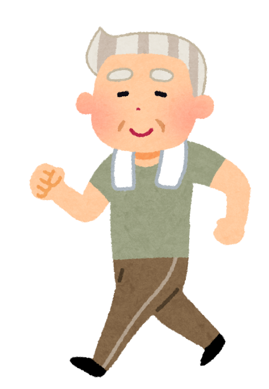
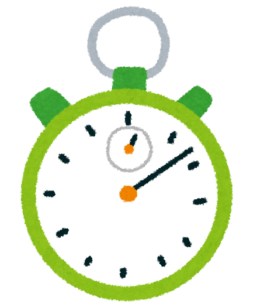

「最近、横断歩道を渡りきる前に、信号が点滅しはじめる」

「一緒に歩いていると、親の足がずいぶんゆっくりになった気がする」

そんなふうに感じたことはありませんか。

歩く速さについて、2026年の夏、アメリカの神経の専門誌に、興味深い研究が載りました。**80歳を過ぎても、同じ年代の人よりずっと速く歩ける人たちは、頭のはたらきも保たれやすかった**、という報告です。

先にお伝えしておきます。**この記事は「速く歩けば認知症を防げます」という話ではありません。** ただ、**歩く速さが「体と頭の元気さを映す鏡」になりうる**、ということは、知っておいて損はないと思います。

> ✅ 80歳以上で、**同じ年代・同じ性別の人よりずっと速く歩ける人**（研究で実際にあてはまったのは約1割）は、そうでない人と比べて、**生活にも支障が出るほどの認知機能の障害が起きる危険が、およそ半分**でした
>
> ✅ 亡くなったあとに脳を調べると、**認知症につながる変化は、ほかの人と同じくらいありました**。それでも頭のはたらきは保たれていた。**「持ちこたえる力」の目印かもしれない**と考えられています
>
> ✅ ただしこれは **観察した研究** です。**「頭の衰えが始まっていたから、歩くのが遅くなった」という逆の順番** もじゅうぶん考えられます

> 歩く「量」についての研究は、こちらでご紹介しています。今回は「速さ」の話です。
> 👉 [1日5,000〜7,500歩で、アルツハイマー病の進行が遅くなる？](/posts/walking-7500-steps/)

---

## 目次

1. [「スーパー・ムーバー」とはどんな人か](#スーパームーバーとはどんな人か)
2. [3つのデータで調べた研究](#3つのデータで調べた研究)
3. [分かったこと その1　認知機能の障害が、およそ半分](#分かったこと-その1認知機能の障害がおよそ半分)
4. [分かったこと その2　脳の中は、ほかの人と同じだった](#分かったこと-その2脳の中はほかの人と同じだった)
5. [いちばん気をつけたいのは「順番が逆」という可能性](#いちばん気をつけたいのは順番が逆という可能性)
6. [正直に書いておきたいこの研究の弱いところ](#正直に書いておきたいこの研究の弱いところ)
7. [理学療法士として現場で思うこと](#理学療法士として現場で思うこと)
8. [自分の歩く速さを、測ってみませんか](#自分の歩く速さを測ってみませんか)
9. [いま私たちにできること](#いま私たちにできること)
10. [おわりに](#おわりに)
11. [参考にした情報](#参考にした情報)

---

## 「スーパー・ムーバー」とはどんな人か

研究をしたのは、アメリカ・ニューヨークにある**アルバート・アインシュタイン医科大学**のジョー・ヴァーギーズ先生たちのグループです。歩き方と脳の関係を、長く研究してきたチームです。

このグループは、**80歳以上で、同じ年齢・同じ性別の人たちの平均より、ずっと速く歩ける人**のことを「**スーパー・ムーバー**」（とても動ける人、という意味）と名づけました。

どれくらい速いかというと、計算の上では**同じ年代の9割以上の人より速い**くらいです。前の研究では「**30歳若い人と同じくらいの速さ**」とも書かれています。


何メートルで何秒、みたいな基準があるんですか？




じつは、**「秒速何メートル以上ならスーパー・ムーバー」という決まった線はない**んです。国ごと、男女ごとに「同じ年代の平均と比べて、どれくらい速いか」で決めています。ですから、**日本人にそのまま当てはめられる数字はありません**。ご自分で目安を測る方法は、あとでご紹介しますね。


---

## 3つのデータで調べた研究

この研究は、**2026年6月**に『**Neurology**』（ニューロロジー）という、アメリカ神経学会の専門誌に発表されました（2026年7月号に掲載）。

おもしろいのは、**性格のちがう3つのデータ**を組み合わせていることです。

| データ | 人数 | 何を調べたか |
|---|---|---|
| 世界の高齢者調査5つをまとめたもの | **3,989人**（平均84歳前後） | 認知機能の障害が、新たに起きるかどうか |
| ニューヨークの長寿研究 | 197人（平均84.6歳） | 頭のはたらきの下がり方と、脳のMRI |
| シカゴの研究（亡くなったあとに脳を調べる） | 692人（平均85.6歳） | 脳の中の、認知症につながる変化 |

どのデータも、**調べはじめた時点で、認知症やアルツハイマー病ではなかった80歳以上の方**が対象です。

---

## 分かったこと その1　認知機能の障害が、およそ半分

いちばん大きなデータ（3,989人）の結果です。

**3.4〜5.4年のあいだ**追いかけたところ、スーパー・ムーバーの方は、そうでない同じ年代の方と比べて、**認知機能の障害が新たに起きる危険が、およそ半分**（0.49倍）でした。

ここでいう「認知機能の障害」とは、

- 記憶などのテストの点数が、同じ年代の平均よりはっきり低い
- **そのうえで**、買い物・お金の管理・電話など、**暮らしの中のこと**にも支障が出ている

という状態のことです。「もの忘れが少し増えた」程度のことではなく、**生活に影響が出るほどの変化**を数えています。

ニューヨークの197人のデータでも、スーパー・ムーバーの方は、**記憶も、それ以外の頭のはたらき（考えるスピードや段取りの力など）も、下がり方がゆるやか**でした。MRIでは、記憶にかかわる**海馬（かいば）の一部の体積が保たれていた**そうです。


半分というのは、すごいですね……。




数字だけを見ると、そう感じますよね。ただ、この「半分」は、**年齢と性別だけをそろえて比べた**ものです。学歴や持病、ふだんの運動習慣などの違いは、そろえていません。スーパー・ムーバーの方は、**もともと持病が少なく、生活習慣もよい人が多い**ことが分かっています。**「速く歩けること」だけの力とは言えない**のです。


---

## 分かったこと その2　脳の中は、ほかの人と同じだった

わたしがいちばん興味深いと思ったのは、シカゴのデータです。

この研究に参加した方は、**亡くなったあとに脳を調べることに、生前に同意されています**。スーパー・ムーバーの方は、生きているあいだ、頭のはたらきがよく、認知症やアルツハイマー病と診断されている人の割合も低くなっていました。

ところが、亡くなったあとの脳を調べると、**アミロイドやタウなど、認知症につながる変化の量は、ほかの人と変わらなかった**のです。

つまり、**脳の中には同じように変化があったのに、頭のはたらきは保たれていた**。研究チームは、スーパー・ムーバーの方には、**脳の変化があっても「持ちこたえる力」がある**のかもしれない、と考えています。

---

## いちばん気をつけたいのは「順番が逆」という可能性

ここは、しっかりお伝えしておきたいところです。

研究チーム自身が、以前の発表でこう書いています。**もの忘れなどの症状がはっきり出てくる前、長い人では10年ほど前から、歩く速さが遅くなりはじめることがある**。

ということは、こうも考えられます。

- **速く歩くから、頭が保たれる**
- **頭（脳）が元気だから、速く歩ける**。脳の衰えが始まると、まず歩き方に出る

歩くという動作は、じつは脳がたくさん働いてこなしています。足の運び、バランス、まわりの確認。**脳の変化が、歩く速さに先に表れる**ことは、十分にありえます。


じゃあ、歩くのが遅くなったら、認知症の始まりなんですか？




**そうとは限りません。** 歩くのが遅くなる理由は、ひざや腰の痛み、筋力の低下、心臓や肺の病気、目の見えにくさなど、たくさんあります。むしろ、**そちらのほうがずっと多い**です。「遅くなったな」と感じたら、**不安になるより、まずは体全体を見直すきっかけ**にしてください。気になるときは、かかりつけ医に相談しましょう。


---

## 正直に書いておきたいこの研究の弱いところ

- **観察した研究**です。「速く歩く練習をすれば防げる」ことを確かめたものではありません
- 比べるときにそろえたのは、**年齢と性別だけ**です
- 対象は**欧米の80歳以上**の方で、日本人に当てはまるかは分かりません

---

## 理学療法士として現場で思うこと

リハビリの現場で、日々いろいろな方の歩く姿を見ています。

その中で感じるのは、**リハビリを続けて歩くのが速くなってくる方は、表情が明るくなり、お話もなめらかになっていく**ということです。

もちろん、これは私が現場で感じていることで、研究のように数えたものではありません。どちらが先なのかも分かりません。それでも、**歩く姿と、その方の元気さは、つながっている**。今回の研究を読んで、あらためてそう感じました。

---

## 自分の歩く速さを、測ってみませんか

スーパー・ムーバーの基準は、日本人にそのまま当てはめられません。そのかわり、日本で使われている**ふたつの目安**があります。

**① 横断歩道の青信号**

横断歩道の青信号は、一般に**秒速1メートル**で歩けば渡りきれるように設定されています（警視庁）。**青のあいだに余裕をもって渡りきれるか**は、ひとつの目安になります。

**② 「秒速1メートル」の目安**

筋肉が減って体の力が落ちる「**サルコペニア**」のアジアの診断基準（2019年）では、**6メートルを秒速1.0メートル未満でしか歩けない**と、「体のはたらきが落ちている」と判断します。

ご自宅でも、次のように測れます。

1. 廊下や公園などで、**まっすぐ6メートル**の距離をとる（前後に2〜3メートルずつ、助走と止まる余裕をつくる）
2. **ふだんの速さで**歩いて、6メートルにかかった時間を測る
3. **6秒より短ければ、秒速1メートル以上**です


がんばって速く歩いて測ってもいいんですか？




**ふだんの速さ**で測るのが基本です。無理に急ぐと、転んでしまうことがあります。**ご家族がそばで見守りながら**、すべりにくい靴で測ってください。**数か月に1回くらい、同じ場所で測る**と、自分の変化に気づきやすくなりますよ。


時間を測るときは、スマートフォンのストップウォッチでもかまいません。**数字の大きい、見やすいもの**があると、ご家族と一緒に測るときに便利です。

{{< affiliate
    title="ストップウォッチ（大きい表示）"
    amazon="https://af.moshimo.com/af/c/click?a_id=5534074&p_id=170&pc_id=185&pl_id=4062&url=https%3A%2F%2Fwww.amazon.co.jp%2Fs%3Fk%3D%25E3%2582%25B9%25E3%2583%2588%25E3%2583%2583%25E3%2583%2597%25E3%2582%25A6%25E3%2582%25A9%25E3%2583%2583%25E3%2583%2581%2520%25E5%25A4%25A7%25E3%2581%258D%25E3%2581%2584%25E8%25A1%25A8%25E7%25A4%25BA"
    rakuten="https://af.moshimo.com/af/c/click?a_id=5533903&p_id=54&pc_id=54&pl_id=27059&url=https%3A%2F%2Fsearch.rakuten.co.jp%2Fsearch%2Fmall%2F%25E3%2582%25B9%25E3%2583%2588%25E3%2583%2583%25E3%2583%2597%25E3%2582%25A6%25E3%2582%25A9%25E3%2583%2583%25E3%2583%2581%2520%25E5%25A4%25A7%25E3%2581%258D%25E3%2581%2584%25E8%25A1%25A8%25E7%25A4%25BA%2F"
    description="6メートルを歩く時間を、ご家族と一緒に測るときに。ボタンが大きく、数字がはっきり見えるものを選ぶと、スマートフォンより手軽に使えます。歩く速さの記録は、数か月ごとに同じ場所で測って比べるのがおすすめです。" >}}

---

## いま私たちにできること

繰り返しになりますが、**「速く歩く練習をすれば認知症を防げる」とは言えません**。研究チームも、そうは言っていません。

研究をまとめたヴァーギーズ先生は、報道の取材に対して、**有酸素運動と筋トレ、そして血圧や糖尿病の管理が、歩く力と脳の両方を支えうる**という趣旨のことを話しています。つまり、**「速く歩けるための体」を保つことが大切**、ということだと思います。

- ✅ **ふだんの散歩で、ときどき「少し速め」の区間をつくる**（信号から信号まで、など。息が弾むくらいで十分です）
- ✅ **足の筋肉を保つ**（椅子からの立ち座り、かかと上げなど）
- ✅ **血圧・血糖など、持病の管理を続ける**
- ✅ **歩くのが急に遅くなった、つまずきやすくなったと感じたら、かかりつけ医に相談する**
- ✅ **数か月に1回、自分の歩く速さを測ってみる**

毎日どれくらい歩いているかを知るには、歩数や歩いた時間を記録できる道具も役に立ちます。

{{< affiliate
    title="ガーミン vivosmart 5"
    image="https://thumbnail.image.rakuten.co.jp/@0_mall/iget/cabinet/garmin2/vivosmart5-1p.jpg"
    amazon="https://af.moshimo.com/af/c/click?a_id=5534074&p_id=170&pc_id=185&pl_id=4062&url=https%3A%2F%2Fwww.amazon.co.jp%2Fdp%2FB09XGX8ZRW"
    rakuten="https://af.moshimo.com/af/c/click?a_id=5533903&p_id=54&pc_id=54&pl_id=27059&url=https%3A%2F%2Fitem.rakuten.co.jp%2Figet%2Fvivosmart5%2F"
    description="歩数や歩いた時間を、手首につけるだけで記録できます。画面が大きく文字も見やすいモデルです。「今日はどれくらい歩いたか」を数字で見られると、散歩を続ける励みになります。" >}}

歩くことが、なぜ脳にとって大切なのか。その理由を、一般の読者向けにやさしく解説した本もあります。

{{< affiliate
    title="運動脳（新版）"
    image="https://thumbnail.image.rakuten.co.jp/@0_mall/bookfan/cabinet/01021/bk4763140140.jpg?_ex=400x400"
    amazon="https://af.moshimo.com/af/c/click?a_id=5534074&p_id=170&pc_id=185&pl_id=4062&url=https%3A%2F%2Fwww.amazon.co.jp%2Fdp%2FB0GVBCKJDW"
    rakuten="https://af.moshimo.com/af/c/click?a_id=5533903&p_id=54&pc_id=54&pl_id=27059&url=https%3A%2F%2Fitem.rakuten.co.jp%2Fbookfan%2Fbk-4763140140%2F"
    description="「歩くこと」を含む体を動かす習慣が、なぜ脳によいと考えられているのか。その理由を、一般の読者向けにやさしく解説した一冊です。散歩を毎日の習慣にするヒントになります。" >}}

> 運動習慣を始めたい方は、こちらもあわせてどうぞ。
> 👉 [認知症リスクを45％下げる運動習慣](/posts/dementia-prevention-exercise/)
>
> 握る力と脳の関係については、こちらで取り上げています。
> 👉 [「にぎる力」が、脳を守る？](/posts/brain-muscle-strength-2026/)

---

## おわりに

80代でもスタスタ歩ける人は、頭のはたらきも保たれやすかった。

とても励みになる結果ですが、**「速く歩けば防げる」ではなく、「速く歩ける体と頭は、つながっている」** というのが、いまの時点で言える、いちばん正直なところだと思います。

歩く速さは、特別な検査をしなくても、**6メートルとストップウォッチがあれば、ご家庭で分かる**数少ない目安です。ご自分のため、そしてご家族のために、一度測ってみてはいかがでしょうか。

---

## 参考にした情報

- Jayakody O, Milman S, Barzilai N, Weiss EF, Wang C, Jin Y, Blumen H, Verghese J「Cognitive Aging and Brain Health: A Comparison of Super Movers vs Nonsuper Movers」『Neurology』2026年;107(1):e214776（2026年6月16日オンライン公開）　https://pubmed.ncbi.nlm.nih.gov/42302219/ （論文の本文は有料のため、この記事は公開されている要旨と、同じ研究チームの学会発表をもとにしています）
- Harvard Health Publishing（ハーバード大学医学部の健康情報）の解説記事、2026年7月　https://www.health.harvard.edu/brain-health/fast-walking-super-movers-may-have-sharper-brains-as-they-age
- 警視庁ウェブサイト（横断歩道の青信号の時間についての解説）
- 長寿科学振興財団 健康長寿ネット（サルコペニアの診断基準 AWGS2019 の解説）

---

※この記事は一般的な情報提供を目的としたものです。歩く速さが遅くなる理由は、認知機能以外にもたくさんあります。**歩き方の変化やもの忘れが気になる場合、また運動を始める場合で持病のある方は、必ずかかりつけ医にご相談ください。** 歩く速さを測るときは、転ばないよう、ご家族の見守りのもとで行ってください。
