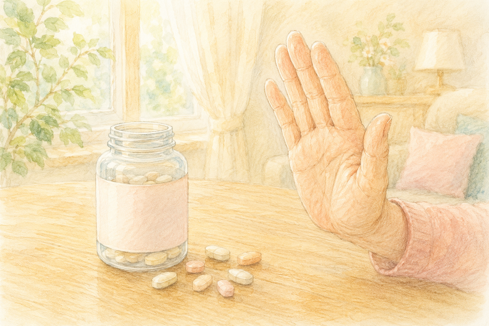

健康診断で「ビタミンの数値は正常ですよ」と言われると、ひと安心しますよね。  
でも、こんな研究をご存じでしょうか。

> **「血液検査では『基準値内』でも、ビタミンB12がやや低めの高齢者は、考えるスピードが少しゆっくりになっていた」**

“足りている”はずなのに、脳には影響が出ているかもしれない――。今回は、そんな少し意外な研究を、やさしくお伝えします。

> ✅ B12が「基準値内でも低め」の高齢者は、**考えるスピード（処理速度）がゆっくりめ** で、脳の白質に小さな変化がみられた
>
> ✅ ただし「サプリをたくさん飲めば脳が良くなる」わけではない。上乗せ効果は **ごくわずか** という報告も
>
> ✅ まずは **食事から**。気になる方は自己判断せず、**血液検査でかかりつけ医に相談** を

---

## 目次

1. [そもそもビタミンB12って？](#そもそもビタミンb12って)
2. [「基準値内なのに足りない」研究の話](#基準値内なのに足りない研究の話)
3. [サプリに飛びつく前に](#サプリに飛びつく前に)
4. [食事でとるには](#食事でとるには)
5. [おわりに](#おわりに)

---

## そもそもビタミンB12って？

ビタミンB12は、**神経や血液を元気に保つ** ために欠かせない栄養素です。魚や貝、肉、卵、乳製品などに多く含まれています。

やっかいなのは、**年を重ねると吸収する力が落ちやすい** こと。さらに、胃の調子や一部のお薬の影響でも、吸収が下がることがあります。つまり「ちゃんと食べているつもり」でも、体の中では足りにくくなっている――そんなことが起こりうるのです。

---

## 「基準値内なのに足りない」研究の話

アメリカのカリフォルニア大学サンフランシスコ校（UCSF）の研究チームが、認知症のない **健康な高齢者231人**（平均71歳）を調べました。

すると――

- B12が **「基準値内でも低め」** の人は、**考えるスピード（処理速度）がゆっくりめ** だった
- さらに、脳の **白質**（はくしつ＝神経の通り道）に、小さな傷のような変化が多くみられた

この研究は2025年に医学誌『Annals of Neurology』に発表され、「**いまの基準値は、脳にとっては少し甘いのかもしれない**」という議論を呼びました。

---

## サプリに飛びつく前に

ここで、とても大事な注意点があります。

「じゃあB12のサプリをたくさん飲めばいいんだ！」――そう考えたくなりますが、**話はそう単純ではありません**。

別の研究では、Bビタミンのサプリで頭の働きが良くなる効果は **ごくわずか** にとどまった、と報告されています。足りない人が補うことには意味があっても、**「たくさん飲むほど脳に効く」わけではない** のです。

サプリは飲み合わせや持病との相性もあります。**自己判断で大量にとるのは避け、まずは血液検査でご自分の状態を知ること** から始めましょう。

> ※ サプリメントや栄養の取り方については、**必ずかかりつけ医にご相談ください。**

---

## 食事でとるには

いちばんの基本は、やっぱり毎日の食事です。B12は、こんな食材に多く含まれています。

> ✅ **あさり・しじみ・牡蠣** などの貝類
>
> ✅ **さんま・さば・いわし** などの魚
>
> ✅ **レバー、卵、牛乳・チーズ、のり**

特別なものではなく、**和食の食卓に自然と並ぶもの** ばかりですね。「最近、魚や貝を食べていないな」と思ったら、週に何回かは意識して取り入れてみてください。

> 食事と脳の関係は、こちらの記事もどうぞ。  
> 👉 [認知症を遠ざける食事のヒント](/posts/dementia-prevention-nutrition/)

---

## おわりに

「基準値内だから大丈夫」と思っていた栄養が、実は脳にとっては少し足りていないかもしれない――。今回の研究は、そんな気づきを与えてくれました。

とはいえ、神経質になりすぎる必要はありません。**魚や貝、卵を、いつもの食卓に少し増やす。** そして気になるときは、ひとりで悩まず、かかりつけの先生に相談する。その小さな積み重ねが、これからの脳を守ってくれます。

---

### 📚 あわせて読みたい一冊

{{< affiliate
    title="脳の毒を出す食事"
    image="https://thumbnail.image.rakuten.co.jp/@0_mall/bookfan/cabinet/00939/bk4478110255.jpg?_ex=400x400"
    amazon="https://af.moshimo.com/af/c/click?a_id=5534074&p_id=170&pc_id=185&pl_id=4062&url=https%3A%2F%2Fwww.amazon.co.jp%2Fdp%2F4478110255"
    rakuten="https://af.moshimo.com/af/c/click?a_id=5533903&p_id=54&pc_id=54&pl_id=27059&url=https%3A%2F%2Fitem.rakuten.co.jp%2Fbookfan%2Fbk-4478110255%2F"
    description="抗加齢医学の第一人者・白澤卓二先生による、脳を守るための食事の本。どんな食材を、どう組み合わせて食卓にのせればよいか――具体的な献立や買い物リストまで載っていて、今日からの食事づくりのヒントになります。" >}}

---

### 参考にした情報

- カリフォルニア大学サンフランシスコ校（UCSF）の研究（高齢者231人、平均71歳）
- 医学誌『Annals of Neurology』2025年発表の論文
- ビタミンB群サプリと認知機能に関する解析報告

※ 本記事は、上記の信頼できる研究・大学発表をもとに、一般読者向けにわかりやすくまとめ直したものです。サプリメントの利用や栄養の取り方は人によって適切な量が異なります。持病のある方・治療中の方は、必ずかかりつけ医にご相談ください。

