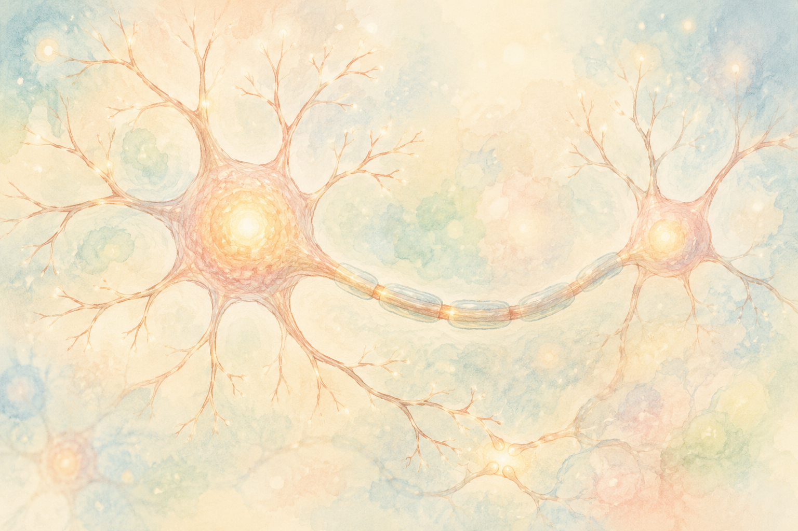

「一度こわれた脳の神経は、もう元には戻らない」――  
長いあいだ、そう考えられてきました。

でも、その常識を少しずつ書きかえるような研究が出てきています。今回は、日本の大学から届いた、こんなお話です。

> **ビタミンKを改良した新しい物質が、「神経のもと」から神経細胞が育つのを、約3倍も後押しした**

ワクワクする話ですが、これも **まだ研究の入り口** の段階です。「将来が楽しみな芽」として、やさしくお伝えします。

> ✅ 芝浦工業大学のチームが、**ビタミンKを改良した新しい化合物** をつくった
>
> ✅ その化合物は、「神経のもと（神経幹細胞）」を神経細胞に変える力が、**天然のビタミンKの約3倍** だった
>
> ✅ ただし、これは **培養した細胞での実験**。市販のビタミンKサプリとは **別物** で、「飲めば脳が再生する」話ではありません

---

## 目次

1. [神経細胞は、本当に増えないの？](#神経細胞は本当に増えないの)
2. [改良型ビタミンKの研究](#改良型ビタミンkの研究)
3. [ここを誤解しないで](#ここを誤解しないで)
4. [おわりに](#おわりに)

---

## 神経細胞は、本当に増えないの？

私たちの脳は、たくさんの **神経細胞** がつながり合ってできています。これらは増えにくく、傷つくと戻りにくい――それが長年の「常識」でした。

ところが近年、脳の中には「**神経のもと（神経幹細胞＝しんけいかんさいぼう）**」が残っていて、条件がそろえば **新しい神経細胞が生まれうる** ことが分かってきました。そこで「このもとを、上手に神経細胞へ育てられないか？」という研究が進んでいるのです。

---

## 改良型ビタミンKの研究

芝浦工業大学のチームは、**ビタミンK** に注目しました。ビタミンKをそのまま使うのではなく、**ビタミンAに関係する成分と組み合わせて**、新しい化合物を設計したのです。

すると、その化合物は「神経のもと」を神経細胞に変える力が、**天然のビタミンKのおよそ3倍** にもなりました。研究チームは、将来的に **アルツハイマー病やパーキンソン病** のように神経が失われる病気の治療に、役立つ可能性があると期待しています。

この研究は2026年、専門誌『ACS Chemical Neuroscience』に発表されました。

---

## ここを誤解しないで

とても大事な注意点があります。

今回すごい働きを見せたのは、研究者が **新しく設計した特別な化合物** です。**納豆や青菜に含まれる、ふだんのビタミンKとは別物** ですし、**市販のビタミンKサプリを飲めば脳が再生する、という話ではありません。**

また、実験は **培養した細胞** で行われたもので、人や動物の体で確かめるのはこれからです。期待しすぎず、研究の進み具合を見守りたいですね。

> ⚠️ **血液をさらさらにするお薬（ワルファリンなど）を飲んでいる方** は、ビタミンKのとり方に注意が必要です。食事やサプリを変える前に、**必ずかかりつけ医にご相談ください。**

ビタミンKそのものは、骨や血管の健康に欠かせない大切な栄養です。納豆・ほうれん草・ブロッコリーなどから、**ふだんの食事でバランスよく** とるのがおすすめです。

---

## おわりに

「こわれた脳は戻らない」という常識が、研究の進歩で少しずつ変わろうとしています。脳が **自分自身を修復する力** を引き出す――そんな未来の入り口に、私たちは立っているのかもしれません。

すぐに治療が変わるわけではありませんが、こうした地道な研究の積み重ねが、いつか大きな希望につながります。今日できることは、バランスのよい食事と、無理のない生活。基本を大切にしながら、明るいニュースを待ちましょう。

---

### 📚 あわせて読みたい一冊

{{< affiliate
    title="LIFESPAN（ライフスパン）老いなき世界"
    image="https://m.media-amazon.com/images/P/4492046747.09._SCLZZZZZZZ_.jpg"
    amazon="https://af.moshimo.com/af/c/click?a_id=5534074&p_id=170&pc_id=185&pl_id=4062&url=https%3A%2F%2Fwww.amazon.co.jp%2Fdp%2F4492046747"
    rakuten="https://af.moshimo.com/af/c/click?a_id=5533903&p_id=54&pc_id=54&pl_id=27059&url=https%3A%2F%2Fbooks.rakuten.co.jp%2Frb%2F16405480%2F"
    description="ハーバード大学の老化研究の第一人者が、「老い」を科学の力でどこまで遅らせ、若返らせられるのかを語った世界的ベストセラー。体や脳が自分を修復する力という、今回の話とも通じるテーマを大きな視野で学べます。" >}}

---

### 参考にした情報

- 芝浦工業大学の研究チーム（ビタミンKを改良した神経再生化合物）
- 専門誌『ACS Chemical Neuroscience』2026年発表の論文

※ 本記事は、上記の信頼できる研究・大学発表をもとに、一般読者向けにわかりやすくまとめ直したものです。紹介した内容は培養細胞を用いた研究段階のものであり、治療効果やサプリメントの効果を示すものではありません。お薬の服用中の方・治療中の方は、必ずかかりつけ医にご相談ください。

