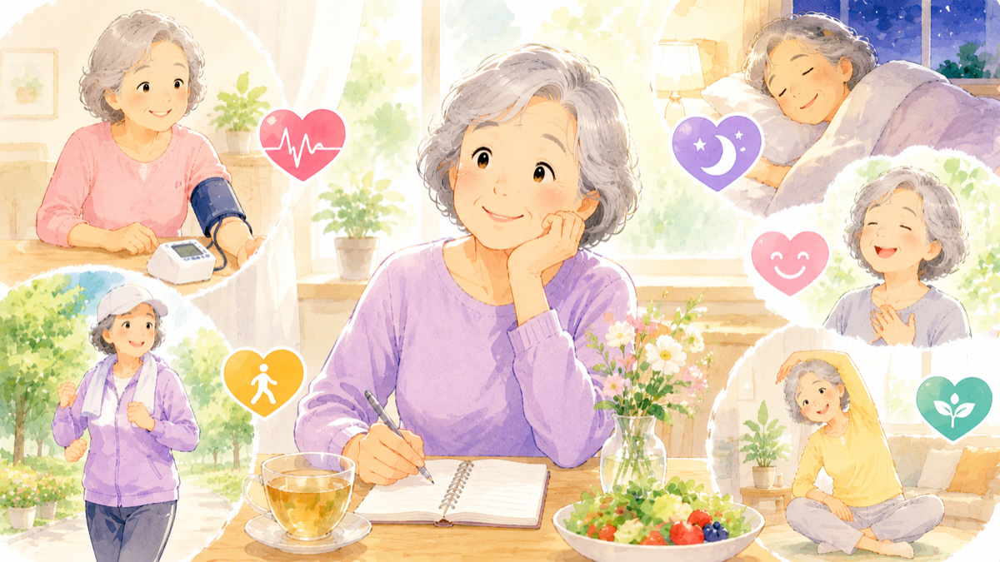

「認知症は、女性のほうがなりやすい」――そんな話を、聞いたことはありませんか？

たしかに、患者さんの数は女性のほうが多いのですが、「長生きする人が多いから」とも言われ、はっきりした理由はわかっていませんでした。

そんな中、1万7千人を調べた研究から、こんな結果が報告されました。

> **「同じリスク因子でも、女性のほうが脳（思考力）への影響が強く出やすい」**

今回は、私たち――特に女性とそのご家族に知っておいてほしい話を、やさしくお伝えします。

> ✅ 高血圧・糖尿病・肥満・難聴などがあると、**男性より女性のほうが「頭の働き（記憶や判断力）の低下」につながりやすい** ことがわかった
>
> ✅ 女性は **うつ・運動不足・睡眠の悩み** を抱える割合も、男性より高めだった
>
> ✅ でも、これらは **すべて「変えられる」リスク**。だからこそ、早めの対策が効きやすい

---

## 目次

1. [どんな研究だったの？](#どんな研究だったの)
2. [女性で影響が強かったこと](#女性で影響が強かったこと)
3. [理学療法士として思うこと](#理学療法士として思うこと)
4. [いま、できること](#いまできること)
5. [おわりに](#おわりに)

---

## どんな研究だったの？

この研究は、アメリカのカリフォルニア大学サンディエゴ校などのチームが、医学誌『Biology of Sex Differences』に発表したものです。

- 対象：中高年〜高齢の **17,000人以上**
- 内容：高血圧・糖尿病・肥満・難聴・うつ・運動不足など、**13の「変えられるリスク因子」** を、男女で比べた

すると、ただ「女性に患者が多い」という話ではなく、**同じリスクでも女性のほうが脳への影響を強く受けやすい**、という傾向が見えてきたのです。

---

## 女性で影響が強かったこと

研究からは、大きく分けて2つのことが見えてきました。

**① 同じ持病でも、女性のほうが「脳への影響」が大きい**

高血圧・肥満・糖尿病・難聴――これらは男性にもありますが、**女性ではこれらが、より強く「頭の働きの低下」につながっていました**。同じ高血圧でも、女性のほうが脳に響きやすい、というイメージです。

**② そもそも、女性に多い悩みもある**

次の3つは、男性よりも女性に多くみられました。

- **気分の落ち込み（うつ）** … 女性は約17%、男性は約9%（女性はおよそ **2倍**）
- **運動不足** … 女性は約48%、男性は約42%
- **睡眠の悩み** … 女性は約45%、男性は約40%

つまり女性は、**脳に影響しやすい要因を「より多く、より強く」抱えやすい**、ということです。

なぜそうなるのか、はっきりした理由はまだわかっておらず、研究が続けられています。でも見方を変えれば、**「女性こそ、早めに気をつけることで守れる部分が大きい」** とも言えそうです。

---

## 理学療法士として思うこと

私自身、母がアルツハイマー型認知症で施設に入所しています。だからこそ、こうした「女性と脳」の話は、どうしても他人事に思えません。

リハビリの現場でも、血圧や糖尿病、聞こえにくさ、気分の落ち込みを抱えた女性は本当に多くいらっしゃいます。そのひとつひとつが脳に効いてくるのなら、**早めに手を打つ意味は大きい** と、あらためて感じます。

---

## いま、できること

特別なことは要りません。女性で影響が強かった項目こそ、**早めに整えたいポイント** です。

> ✅ **血圧** を家でときどき測る習慣を
>
> ✅ **聞こえにくさ** は我慢せず、早めに耳鼻科や補聴器の相談を
>
> ✅ **体を動かす**。散歩や体操を、無理のない範囲で毎日少しずつ
>
> ✅ **気分の落ち込み・眠れない** が続くときは、ひとりで抱えずかかりつけ医に相談を

> あわせて読みたい記事もどうぞ。  
> 👉 [日本人の認知症、約4割は予防できる 〜14のリスク因子〜](/posts/dementia-japan-14-factors/)

---

## おわりに

「女性のほうが影響を受けやすい」と聞くと、少し不安になるかもしれません。でも裏を返せば、**手を打てば、その分しっかり守れる** ということでもあります。

血圧、聞こえ、体を動かすこと、心の元気――。どれも今日から始められる、小さな一歩です。ご自身のために、そして大切なご家族のために、できるところから一緒に始めていきましょう。

---

### 📚 あわせて読みたい一冊

{{< affiliate
    title="最高の体調"
    image="https://thumbnail.image.rakuten.co.jp/@0_mall/bookfan/cabinet/00814/bk4295402125.jpg?_ex=400x400"
    amazon="https://af.moshimo.com/af/c/click?a_id=5534074&p_id=170&pc_id=185&pl_id=4062&url=https%3A%2F%2Fwww.amazon.co.jp%2Fdp%2F4295402125"
    rakuten="https://af.moshimo.com/af/c/click?a_id=5533903&p_id=54&pc_id=54&pl_id=27059&url=https%3A%2F%2Fitem.rakuten.co.jp%2Fbookfan%2Fbk-4295402125%2F"
    description="睡眠・運動・気分の落ち込み・腸内環境まで――今回の記事で出てきた「変えられるリスク」を、暮らしの中でどう整えるかが、やさしくまとまった一冊。シニア世代にも読みやすい内容です。" >}}

---

### 参考にした情報

- カリフォルニア大学サンディエゴ校などの研究（中高年〜高齢者17,000人以上）
- 医学誌『Biology of Sex Differences』2026年発表の論文
- 米国 Health and Retirement Study（健康と退職に関する調査）のデータ

※ 本記事は、上記の信頼できる研究・大学発表をもとに、一般読者向けにわかりやすくまとめ直したものです。リスク因子の感じ方・影響には個人差があります。気になる症状や持病のある方は、必ずかかりつけ医にご相談ください。

